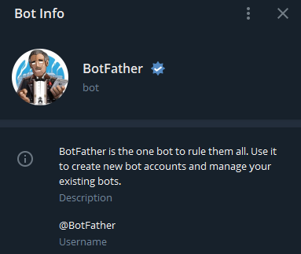

<!-- Template: https://github.com/othneildrew/Best-README-Template -->

[![LinkedIn][linkedin-shield]][linkedin-url]

<!-- PROJECT LOGO -->
<br />
<p align="center">
  <a href="https://github.com/v1et4nh/PriceScraper-Telegram-Bot">
    
  </a>

  <h3 align="center">PriceScraper-Telegram-Bot</h3>

  <p align="center">
    A pricescraper for <a href="https://www.flaschenpost.de">flaschenpost.de</a>
    <br />
    Price alert send via Telegram
    <br />
    <br />
  </p>
</p>

<!-- TABLE OF CONTENTS -->
<details open="open">
  <summary>Table of Contents</summary>
  <ol>
    <li>
      <a href="#what-is-the-project-about-and-why">What is the Project about and why?</a>
    </li>
    <li>
      <a href="#getting-started">Getting Started</a>
      <ul>
        <li><a href="#telegram-bot-configuration">Telegram Bot Configuration</a></li>
        <li><a href="#virtual-environment">Virtual Environment</a></li>
        <li><a href="#installation">Installation</a></li>
      </ul>
    </li>
    <li><a href="#usage">Usage</a></li>
    <li><a href="#contact">Contact</a></li>
    <li><a href="#sources">Sources</a></li>
  </ol>
</details>


<!-- ABOUT THE PROJECT -->
# What is the Project about and why?
Because I am super lazy I use the service of beverage delivery directly to my door. 
There is only one company in my region: The german www.flaschenpost.de (No Affiliate-Link :P) 
Sometimes it's even cheaper to order on their website than buying in the supermarket. 
But as I already mentioned, I am super lazy and I also don't really want to look up for their super deals all over again..
That's why I started this little project to save my valuable time 
(and maybe also to improve my programming skills. Nice!).

Here is my idea:
* Get the price from www.flaschenpost.de with a webscraper
* If the price falls below a certain amount -> send me a message on telegram
* Message content: Beverage + Price + Url (+ Screenshot of the current page)

And here are my steps:
* Use Python because it's easy
* Use Selenium to navigate through the website and get the price
* Use Telegram API to send messages and images

<!-- GETTING STARTED -->
# Getting Started
So before we jump in, we first need to configure our Telegram Client or Bot...

## Telegram Bot Configuration
* Obviously you need a Telegram Account, so get the app and create a new account
* Once you've installed the app and logged in, you need to create your own bot. For that search for `@BotFather`: <br>
<p align="center"></p>

### Create new Bot and get `bot_token`
* Send him a "/start" message or press the Start Button and create a new bot by sending "/newbot"
* Follow the instructions (username, botname)
* Be sure to save the API Token ("Use this token to access the HTTP API"), which will be needed later, that's your `bot_token`

### Get `bot_chatID`
* Now search for your bot (the username you just created) in your telegram app
* Send "/start" or press the Start Button
* Open a new tab and enter `https://api.telegram.org/bot<yourtoken>/getUpdates`
* Replace `yourtoken` with the `bot_token`
* Assume the `bot_token` = 123abc456, then the address would be: <br>`https://api.telegram.org/bot123abc456/getUpdates`
* You will see a json-like format. Look for `"id"`. Thats your `bot_chatID` <br>
Note: You will only see the ID once you send your bot the "/start" message <br> <br>
That's it for now. Keep both your `bot_token` and `bot_chatID` ready for later :)

## Virtual Environment
This chapter is optional but still highly recommended to keep your projects tidy.
* Create a new virtual environment
    ```sh
    $ virtualenv venv
    ```
* Activate the new created virtual environment `venv`
    ```sh
    # Windows
    $ venv\Scripts\activate.bat
    # Unix
    $ source venv//bin/activate
    ```
* If the virtual environment is activated correctly, your console should look like this:
    ```sh
    $ (venv)  
    ```
* Install the required dependencies for this project
    ```sh
    $ (venv) pip install -r requirements.txt
    ```
 
## Installation

1. Now we are ready to clone the repo
   ```sh
   git clone https://github.com/v1et4nh/PriceScraper-Telegram-Bot
   ```
2. I highly recommend to create a `.env`-file to store your `bot_token` and `bot_chatID` in there:
   ```.env
   TELEGRAM_BOT_TOKEN  = <yourtoken>
   TELEGRAM_BOT_CHATID = <yourchatID>
   ```
   This way you can hide your token and ids. <br>
   Otherwise, if you don't intend to share your code, you can also just insert your `bot_token` and `bot_chatID` directly in the `main.py`-sourcecode:
   ```.pydocstring
   16 # Load environment variables
   17 load_dotenv()
   18 bot_token  = <yourtoken>    # Replace with your own bot_token
   19 bot_chatID = <yourchatID>   # Replace with your own bot_chatID
   ```

<!-- USAGE EXAMPLES -->
## Usage
Once everything is set up, you can just run the script and see what happens. 
* If you want to hide your browser, just uncomment this line:
```.pydocstring
# os.environ['MOZ_HEADLESS'] = '1'  # Run Firefox in the background
```
* Adjust the links and the name in `if __name__ == "__main__"` to your personal preferences:
```pydocstring
if __name__ == "__main__":
    # Web Scraping
    name_list = []
    url_list  = []
    name_list.append('Volvic')
    url_list.append('https://www.flaschenpost.de/volvic/volvic-naturelle')
    name_list.append('Spezi')
    url_list.append('https://www.flaschenpost.de/paulaner-spezi/paulaner-spezi')
    name_list.append('FritzKola')
    url_list.append('https://www.flaschenpost.de/fritz-kola/fritz-kola')
```
* Adjust your zipcode in `get_flaschenpost_price`-function or add it to your `.env`-file:
```pydocstring
    zipcode_input.send_keys(os.getenv('ZIPCODE'))
```

<!-- CONTACT -->
## Contact

Viet Anh Le Cong - [@linkedin](https://linkedin.com/in/viet-anh-le-cong) - hello@v1et4nh.de

Project Link: [https://github.com/v1et4nh/PriceScraper-Telegram-Bot](https://github.com/v1et4nh/PriceScraper-Telegram-Bot)

## Sources
* [Medium: Man Hay Hong](https://medium.com/@ManHay_Hong/how-to-create-a-telegram-bot-and-send-messages-with-python-4cf314d9fa3e)
* [Official Telegram Bot Homepage](https://core.telegram.org/bots)

<!-- MARKDOWN LINKS & IMAGES -->
<!-- https://www.markdownguide.org/basic-syntax/#reference-style-links -->
[linkedin-shield]: https://img.shields.io/badge/-LinkedIn-black.svg?style=for-the-badge&logo=linkedin&colorB=555
[linkedin-url]: https://linkedin.com/in/viet-anh-le-cong
